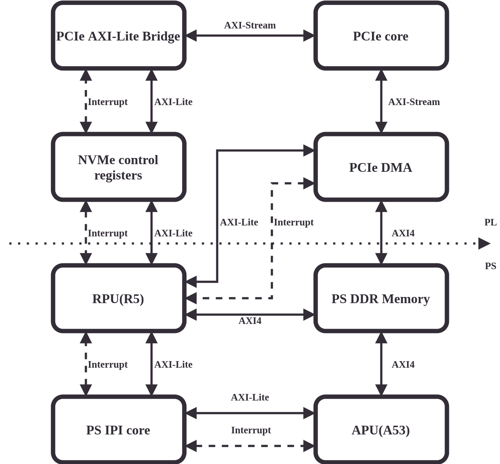

FPGA design
===========

This chapter describes the FPGA design that will be used on the target platform.
It will utilize Zynq US+ MPSoC's PCIe hard block and additional supporting logic to handle NVMe physical layer and expose the NVMe configuration registers and DMAs to the RPU.

A diagram that presents the connections between various elements of the design is shown below:

There are four major parts that can be distinguished:

* PCIe core, which will handle the basic PCIe protocol and will provide:

  * Host access to NVMe control registers using BAR space
  * Access to Host memory for PCIe DMA.
  * Support for generating Host interrupts.

* The RPU core, NVMe control reigsters and PCIe DMA that will be responsible for handling the base NVMe protocol:

  * RPU will implement NVMe handling logic.
  * NVMe control registers will provide register space required by the NVMe specification and will generate required interrupts, e.g. on writes to ``Doorbell`` registers).
  * PCIe DMA will be responsible for transferring data to and from the Host memory.

* The APU core and PS IPI core that will be responsible for handling custom NVMe commands:

  * The IPI core will be used to communicate between RPU and APU.
  * APU will implement logic that handles custom NVMe commands.

* Shared PS DDR memory will be used by both APU and RPU cores and will be used as buffer before transferring NVMe data to/from the Host.

Building the design
-------------------

Instructions for building the design (and the whole project) are present in the :gh:`alkali-csd-projects README <alkali-csd-projects>` and :gh:`alkali-csd-hw README <alkali-csd-hw>`.

.. note:: Building the design will require Vivado 2019.2 to be installed on the development PC.

.. _nvme_ip:

NVMe register module
--------------------

The NVMe register module is an IP core written in Chisel that implements Controller Registers described in the NVMe Specification.

The register map follows the register layout from the specification and by default contains 5 pairs of doorbell registers.

On top of implementing basic Controller Registers, this module contains additional logic that is used by the firmware running on the RPU for:

* Generating RPU interrupts on Host writes

    On each Host write, register address is saved to Host Write Address FIFO which can later be accessed by the RPU to see which registers have been written and require action.

* Generating Host interrupts

    RPU can trigger one of the 32 MSI interrupts by writing to a control register with correct bits set, e.g. writing a value with bit 31 set sends interrupt 31.

To be able to use those additional features, the core contains three additional registers:

* Interrupt Status Register - by default located at ``0x1028`` which returns ``1`` when there is at least one entry in Host Write Address FIFO.
* Interrupt Data Register - located at ``0x102c`` returns oldest entry from Host Write Address FIFO when read.
* Host Interrupt Register - located at ``0x1030`` triggers Host interrupt when written.

Generating NVMe IP
++++++++++++++++++

NVMe IP is written in Chisel which means that synthesizable Verilog must be first generated from sources.
The sources for generating NVMe IP is present in :gh:`alkali-csd-hw/tree/main/chisel`.

It is built within :gh:`alkali-csd-hw build flow, described in its README <alkali-csd-hw>`.

To just generate the NVMe IP, the following dependencies are required:

* Scala (2.13.0)
* SBT
* Java

.. note:: A :gh:`Dockerfile for building HW artifacts <alkali-csd-hw/blob/main/hw.dockerfile>` is a recommended environment for generating the NVMe IP.

Once the dependencies are present, run::

    git clone https://github.com/antmicro/alkali-csd-hw.git
    cd chisel
    make verilog

Updating register definitions
_____________________________

You can update the register definitions using :gh:`nvme-registers-generator`.

Those generator scripts take the NVMe Specification ``.pdf`` file as an input and based on that generate register definitions that can be used in Chisel.

For details on generating register definitions check the :gh:`nvme-registers-generator README <nvme-registers-generator>` file in the repository.

Adding new registers
++++++++++++++++++++

NVMe IP can be expanded with additional registers, either unimplemented optional ones or vendor specific.

To add a new register, you can use the following steps:

#. Check if your register layout is defined in ``RegisterDefs.scala`` (this only applies if you want do add an unimplemented register).
   Take a look into ``CSRRegMap.scala`` if your register was already defined - it might be already present as a simple ``StorageRegister``.

#. Add new register layout definition to ``CSR.scala`` if needed.

   ``IRQHOST`` can be used as an example:

   .. code-block:: bash

     class IRQHOST extends RegisterDef {
       val REQ = UInt(32.W)
     }

#. Instantiate new register as a module in ``CSRFile.scala``, make all needed connections and add it to ``regMap``.

   ``IRQHOST`` can be used as an example:

   .. code-block:: bash

     val irqHost = Module(new AutoClearingRegister(new IRQHOST, dataWidth))

     println(f"adding Host interrupt register at 0x${irqHostBase}%x")
     regMap(irqHostBase) = irqHost

     io.irqHost := irqHost.fields.REQ

VTA module
----------

The VTA is an IP core written in HLS that is used by TFLite to accelerate certain operations.
You can find more information about using it in :doc:`vta-accelerator`.

To build the VTA and whole HW design, follow the :gh:`README in alkali-csd-hw <alkali-csd-hw/tree/main>`.

Built artifacts
---------------

The ready-to-use binaries for the hardware are available under :gh:`alkali-csd-hw releases <alkali-csd-hw/releases>`.
